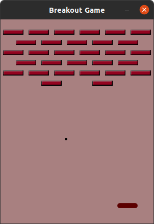

Breakout_Game
=============
A simple implemantation of the well-known Breakout game.

This project is based on *Qt5 framework*. You must have *Qt5* installed on you system.

Screenshots
===========
 <div align="center">
    
    
    
</div>

 <div align="center">
    
    
    
</div>

 <div align="center">
    
    
</div>

How to play?
===========
- On *Ubuntu 20.04*: Assuming that you have cloned this repository and you are inside the folder that contains the files of the project, open a terminal:

``` sh
qmake
make
./Breakout
```

Dependencies
============
- *Qt5 framework*. You must have it installed on you system. For example, on *Ubuntu 20.04*:

``` sh
sudo apt install qt5-default
```
